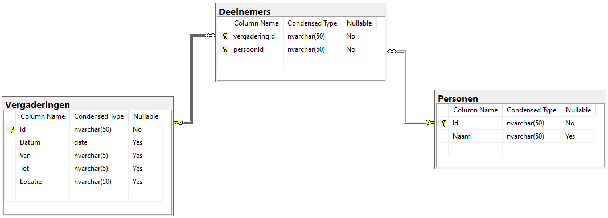
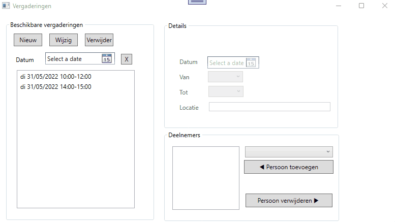

# Oefening SCALA.VERGADERINGEN

### Stap 1 : installeer het SQL script dat je hier kan vinden
  
<a href="https://github.com/scala-start2program/DBProgVergaderingen_start/blob/master/assets/ScalaVergaderingen.sql" target="_blank">ScalaVergaderingen.sql</a>
  
### Stap 2 : bestudeer aandachtig het ERD diagram.  Let vooral op de betekenis van de tabel **Deelnemers** 
  
  
   
### Stap 3 : bestudeer aandachtig het onderstaande demo filmpje en zorg er voor dat je app hetzelfde doet.
  

